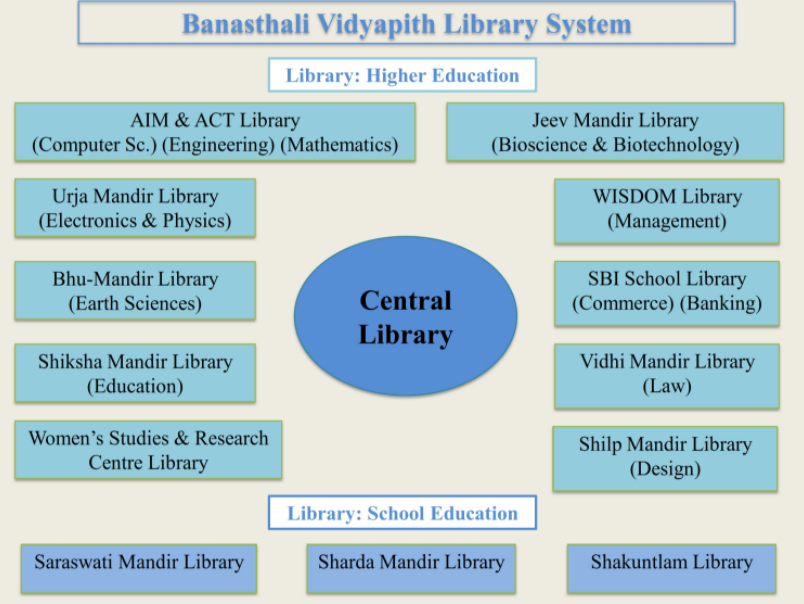
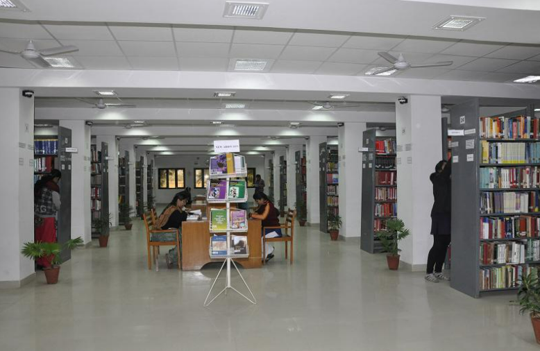
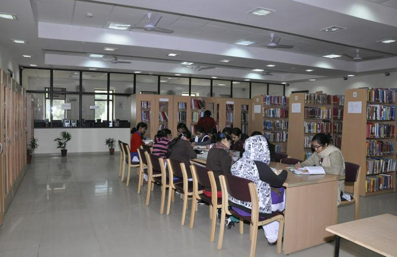
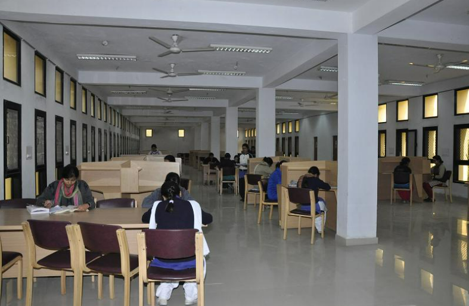

# _Library_

The Banasthali Vidyapith library came into existence in 1935; till 1939 the library procured 1700 books and a Reading Room for students. "Veerbala" a quarterly journal was also brought out for students to improve their creative ability and writing. The library collection grew to 5000 and 12,000 books in 1945 and 1955 respectively. The primary mission of the library is to support the educational and research programme in the Vidyapith by maximizing access to information. In order to fulfill the objectives of the Vidyapith, the library aims to develop a comprehensive collection of documents useful for the faculty and the research community. This rich and valuable collection built over eight decades has some of the rare reference materials and several important journals.

Since then there is consistent growth of the collection of the library. Today, the Libraries' collection exceeds 450000 records including books, reports, theses, dissertations, bound journals, manuscripts, albums, maps, charts, audio/video cassettes, gramophone records, CDs/DVDs, atlas, slides and many more. The library currently receives over 500 national and international print journals. In addition, so many e-journals, e-databases and e-books are subscribed by the libraries. The access of eShodhSindhu is also available. The library offers Reference Services, Users' Orientation Services, Circulation Services, Current Awareness Services, and Plagiarism Checking etc.

In the Central Library access to the Internet is provided via around 8 Mbps Internet is provided via different modes such as BSNL leased line, VSNL leased line. The library has been using the LIBSYS, an Integrated Library Management software package with all the modules for the library housekeeping operations. The library online Catalogue (OPAC) has more than 1.60 lakhs records of books (Bibliographic Information) and 13,500 back volumes of periodicals.

In addition to Central Library there are 10 departmental libraries in higher education system and 3 libraries in school division.

All the libraries have been using the LIBSYS, an Integrated Library Management software package with all the modules for the library housekeeping operations.

## <h2 className="text-center text-info"> Mission and Vision </h2>

The mission of ‘Library System’ is to provide comprehensive resources and services in support of the research, teaching, and learning needs of the Vidyapith community. To fulfill this mission, the Library commits to:

> 
*Build collections and create tools to support research and learning;

> 
*Maximize access to and promote the use of internal as well as external information resources;

> 
*Ensure the preservation and long-lasting availability of library resources;

> 
*Create attractive and comfortable  physical and virtual environments for study, and research;

> 
*Collaborate with vidyapith faculty and researchers to enrich the collection services.

The Library System ensures that its collections remain forward-looking, diverse in breadth and form, open to browsing, and of world-renowned quality.

##### <h6 className="text-center text-info"> INFLIBNET Document Delivery Centre under JCCC Service </h6>

The INFLIBNET Centre of UGC has identified Banasthali Vidyapith as one of the Document Delivery Centre for J-gate Custom Content for Consortia (JCCC). This is an inter-library loan service amongst university libraries in India. As an ILL, the Central Library has fulfilled 2500+ queries of other universities across the India.

#### <h6 className="text-center text-info"> Library Team </h6>

| Designation             | Name                       | Library                                  |
| :---------------------- | :------------------------- | :--------------------------------------- |
|                    |                            |                                          |
| Deputy Librarian        | Dr. Asha Sharma            | Central Library                          |
|                         | Dr. Laxmi Gupta            | Shiksha Mandir Library                   |
|                    |                            |                                          |
| Assistant Librarian     | Mr. Mukesh Mangal          | Vidhi Mandir Library                     |
|                         | Dr. Rajendra Kumar Gupta   | Urja Mandir Library                      |
|                         | Ms. Rekha Saxena           | Central Library                          |
|                         | Ms. Shaivalini Singh       | Central Library                          |
|                         | Dr. Shesh Mishra           | Central Library                          |
|                         | Dr. Sunil Bhatt            | Central Library                          |
|                    |                            |                                          |
| Sr. Technical Assistant | Dr. Praveen Babel          | WISDOM Library                           |
|                         | Dr. Rajneesh               | AIM & ACT Library                        |
|                    |                            |                                          |
| Jr. Technical Assistant | Mr. Devendra Singh Rajawat | Central Library                          |
|                         | Mr. Govind Prasad Gupta    | Central Library                          |
|                         | Dr. Kanhaiyalal Sharma     | AIM & ACT Library                        |
|                    |                            |                                          |
| Technical Assistant     | Ms. Archana Chaudhary      | Shilp Mandir Library                     |
|                    |                            |                                          |
| Library Assistant       | Mr. Ajay Parashar          | Shiksha Mandir Library                   |
|                         | Mr. Banwari Lal Sharma     | Central Library                          |
|                         | Mr.Chandra Shekhar Sharma  | Sharda Mandir Library                    |
|                         | Mr. Girdhar Sharma         | Bhu Mandir Library                       |
|                         | Mr. Jaiprakash Gupta       | Central Library                          |
|                         | Ms. Jaya Sharma            | Central Library                          |
|                         | Mr. Kajod Tailor           | Shilp Mandir Library                     |
|                         | Ms. Leena Kumari           | Saraswati Mandir Library                 |
|                         | Ms. Manju Sharma           | Central Library                          |
|                         | Mr. Padam Dev Jain         | Shakuntalam Library                      |
|                         | Ms. Preeti Singh           | AIM & ACT Library                        |
|                         | Mr. Ramswaroop Gurjar      | Shilp Mandir Library                     |
|                         | Ms. Rasal Devi Gupta       | Law Library                              |
|                         | Ms. Reena Mishra           | Jeev Mandir Library                      |
|                         | Ms. Sunita Gupta           | Urja Mandir Library                      |
|                         | Ms. Sunita Soni            | Sharda Mandir Library                    |
|                         | Ms. Swati                  | Central Library                          |
|                         | Ms. Veena Thareja          | SBI School of Commerce & Banking Library |
|                         | Mr. Vikram Singh           | Central Library                          |
|                    |                            |                                          |
| Library Clerk           | Ms. Jyoti Gupta            | Central Library                          |

 

#### <h6 className="text-center text-info"> Facilities </h6>

> 1.         Xerox Centre

> 2.         Labs for Online Resources

> 3.         OPAC for searching library database

> 4.         Document Delivery

> 5.         Reading Hall

|  |  |  |
| :-------------------------------------------- | :-------------------------------------------- | :-------------------------------------------- |

 

###### _[Online Resources](http://103.214.128.132:9876/jspui/)_
