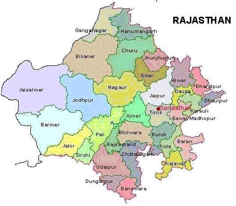

# _How to Reach Banasthali_

Banasthali is well linked by road, rail and air :

## **[ROAD LINK :](http://www.banasthali.org/banasthali/wcms/en/home/lower-menu/how-to-reach-banasthali/road_map10.gif)**

72 km. from Jaipur. 8 km. off. Jaipur-Kota Road at 65 km. stone. There are 14 buses of Rajasthan Roadways Transport Corporation at Jaipur-Banasthali route.

#### <h6 className=" text-info"> Timings of Buses </h6>

| From Banasthali Vidyapith To  | From Jaipur To                              |
| :---------------------------- | :------------------------------------------ |
|                          |                                             |
| Jaipur 5:30 (from campus)     | Banasthali Vidyapith 5:45 (till capmus)     |
| Jaipur 6:00 (from campus)     | Banasthali Vidyapith 7:00 (till main gate)  |
| Jaipur 7:00 (from campus)     | Banasthali Vidyapith 8:15 (till main gate)  |
| Jaipur 8:15 (from campus)     | Banasthali Vidyapith 9:15 (till campus)     |
| Jaipur 10:00 (from main gate) | Banasthali Vidyapith 11:30 (till main gate) |
| Jaipur 11:15 (from main gate) | Banasthali Vidyapith 13:45 (till campus)    |
| Jaipur 12:00 (from campus)    | Banasthali Vidyapith 17:00 (till campus)    |
| Jaipur 14:15 (from main gate) | Banasthali Vidyapith 17:30 (till campus)    |
| Jaipur 16:45 (from campus)    | Banasthali Vidyapith 18:15 (till campus)    |
|                          |                                             |

## **[RAIL LINK :](http://www.banasthali.org/banasthali/wcms/en/home/lower-menu/how-to-reach-banasthali/rail_map1.gif)**

<h5 className="text-warning">Banasthali Newai</h5>
Railway station is on the Jaipur-Swaimadhopur-Mumbai broad gauge line of the Western Railway. It is equidistance from Jaipur and Swaimadhopur, 66 Kms from both.

<h5 className="text-warning">Jaipur</h5>
Is on Delhi-Ahmedabad Broad-guage main line of Western Railway and there are direct trains to Jaipur from Delhi-Junction, Agra Fort, Ahmedabad, Indore, Mumbai, Udaipur, Bikaner, Jodhpur, Chennai, Bangalore, Howrah etc.

<h5 className="text-warning">Swaimadhopur</h5>
Is on Delhi-Mumbai Central Broad gauge main line of the Western Railways. Their are direct trains to Swaimadhopur from Agra Fort also.

## **[AIR LINK :](http://www.banasthali.org/banasthali/wcms/en/home/lower-menu/how-to-reach-banasthali/air_map01.gif)**

Banasthali has its own licenced Air Field (09/26). Jaipur Airport is 59 km.

# _Transport inside Banasthali_

Minibuses are run as shuttle service at the interval of 15 minutes. Bus is also provided to the Banasthali-Newai Railway station 7 kms. away from the campus.
