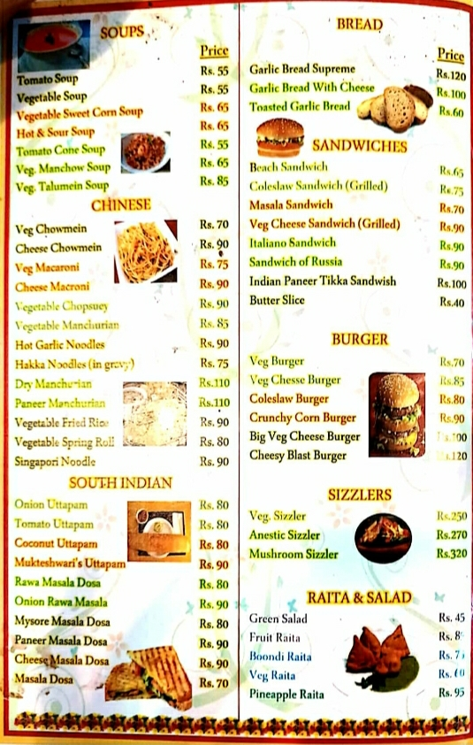

# _Crazy Masala Food_

<h2 className="text-info">20 Trendy Dishes Of Canteens In Banasthali</h2>

#### ** 1. Maggie**

The Maggie is a very regular dish which is liked and admired by all. But the students of Banasthali love the Maggie made by the Mukteshwari Canteen. The Maggie is made by the people who are the professional cook, and they make Maggie differently. The soupy Maggie of this canteen is very famous and popular.

#### ** 2. Cold Coffee**

The Mukteshwari canteen is situated on the opposite of Surya Mandir which is far away from the hostels of the girls. But because of the cold coffee of this canteen girls travel far away. The special cold coffee is liked so much by the students residing there.

#### ** 3. Pasta**

The Pasta of Old market is very popular. The pasta is made by the ingredients like different veggies and cheese. The twist is that the pasta made in this canteen is not cooked or baked in the oven. It is made on the stove only. It adds the desi flavour to the dish.

#### ** 4. Cheese Vada Pav**

The Vada Pav is the common dish but when we say cheese vada pav the story changes at the time. The slice of cheese is added into it to make it modern or to give it the touch which is liked by the youth. The cheese vada pav is served with the fresh green chillies and sliced onion.

#### ** 5. Cheese Maggie**

The Maggie is loved by all and the cheese too that is why both the lovable thongs are mixed, and it is presented in one. The dish is known as cheese Maggie. The Maggie is normally made. The cheese is sprinkled over it while serving. Then it is served hot.

#### ** 6. Tiranga Pulao**

The Tiranga Pulao is the type of biryani in tri colour. The pulao is made in different ways in three types. And then the layers are served in the plate. The texture of the pulao is like the flag and then it is served hot with achar, papad, salad, onion and lemon juice.

#### ** 7. Manchurian**

The Manchurian of this canteen is very famous and classy. The Manchurian is made up of the ingredients like cabbage, cauliflower, onion, capsicum and different types of Chinese sauces. The Manchurian can be made dry as well as in gravy. All the vegetables are grated, and the corn flour is mixed with it. Then it is made or converted like the balls and then it is deep fried. The Manchurian gravy is made up of the sauces like chilli sauce, tomato sauce, soya sauce and vinegar. Then it is mixed and served hot to the consumers.

#### ** 8. Tea**

The speciality of the Mukteshwari Canteen is there special Tea. The masala tea they serve is loved by the girls. The tea is made up of the special ingredients like adrak, kaali mirchi, etc. The tea of this canteen is very popular in the market of Banasthali.

#### ** 9. Samosa**

The Samosa is very popular dish of India. The deep fried dish is served with the two type of chutney. The dish is made up of the ingredients like meda flour, aloo and the Indian spices. The dish can be converted into the samosa chaat. In which the samosa is served with the yoghurt and chole. The dish is perfect Indian culture food.

#### ** 10. Kachori**

The another street food served by the Mukteshwari Canteen. The dish is the traditional food of Rajasthan. The kachori is made up in two different ways. The first one is made up of is aloo kachori in which the stuffing of aloo is filled, and the another one is of moong daal in which the stuffing of moong daal is filled. Then it is served with the chutney, and the dish is mouth watering.

#### ** 11. Chinese Bhel**

The Chinese Bhel is the new arrival in the menu of Mukteshwari canteen. The dish is made up of the deep fried noodles and different veggies like capsicum, onion, tomato and cucumber. The all veggies car cut into small pieces then it is mixed with the fried noodles. After that it is served with the lemon juice sprinkled up on it.

#### ** 12. Pani Puri**

The famous Pani Puri of this particular canteen is loved by all the girls residing there. The pani is made specially with the lots of masala. The pani is made up of the ingredients like dhaniya, mirchi and chutney. And the puri is served with that special pani. Then, at last, the sukhi is given which is made with puri without water. Then the namkeen is sprinkled over it.

#### ** 13. Fried Idli**

Fried Idli is the type of dish which is desi and yummy. At the initial stage, the idli is normally made. Then the idli is divided into four pieces, and after that, they are shallow fried in the nariyal ki chutney and some Indian spices like red chilli powder, kadi patta, etc. Then it is served hot.

#### ** 14. Bhel Puri**

The Bhel Puri is the famous street food of India which is made up the ingredients like different types of sev, onion, tamatar and chutney. The dish is instantly made. The speciality of this canteen is bhel puri.

#### ** 15. Mirchi Vada**

The another type of chat is mirchi vada. The mirchi vada is the bhajiya of mirchi in which mirchi is dipped in the besan flour and deep fried. Then the mirchi vada chaat is presented to the consumer by the canteen. In a plate, the vada is kept and the khati-mithi chutney is put up on it. Then it is served hot.

#### ** 16. Khasta**

Khasta is the snack which is available in the Banasthali. The khasta is made up of the meda roti and it is deep fried. The dish can also be converted into the khasta chat in which the desi tadka is added. Then it is served with the garnishing of sev namkeen up on it.

#### ** 17. Aloo Chaap**

Aloo Chap is the type famous Indian street food which is very famous in the campus of Banasthali. The dish is served like a aloo tikki is crushed, and the curd is spread over it and some masalas with khati mithi chutney. The dish is very much popular in because girls love chat so much.

#### ** 18. Masala Dosa**

The Masala Dosa of the Mukteshwari Canteen is very popular in the Banasthali. The dish is made up of the ingredients like rice flour and aloo masala. The dosa is served with sambhar and nariyal ki chutney. The students come from there hostels to eat this special dish of this canteen.

#### ** 19. Ice Cream Shake**

Ice Cream Shake of this canteen is very popular in the campus. The shake is delicious. It is made up of the ingredients like different flavour ice cream, milk and cream. All the ingredients are mixed and served chilled with the ice cube.

#### ** 20. Pav Bhaji**

The Pav Bhaji is the popular street food of India. The pav bhaji is made up of the two main ingredients that are pav which is available in the market easily and the bhaji which is made by the seasonable vegetables. The dish is tasty as well as healthy. Then the pav bhaji is served with the slice of butter and salad.

 

<h1 className="card card-body shadow mb-4 bottom-border text-center text-warning">Menu Cards

<h1 className="text-center text-danger border-bottom">Jaipur Eats</h1>

|  |  |  |  |
| :---------------------------------------- | :---------------------------------------- | :---------------------------------------- | :---------------------------------------- |

|  |  |  |
| :---------------------------------------- | :---------------------------------------: | ----------------------------------------: |

<h1 className="text-center text-info border-bottom">Spicy Bite</h1>

|  |  |  |  |
| :---------------------------------------- | :---------------------------------------- | :---------------------------------------- | :---------------------------------------- |

|  |  |  |  |
| :---------------------------------------- | :---------------------------------------- | :---------------------------------------- | :---------------------------------------- |

|  |  |  |  |
| :---------------------------------------- | :----------------------------------------- | :----------------------------------------- | :----------------------------------------- |

<h1 className="text-center text-success border-bottom">Mukteshwari's</h1>

|  |  |  |
| :---------------------------------------- | :---------------------------------------- | :---------------------------------------- |

</h1>

<h2 className="text-info">Facilities</h2>

> Service options - Delivery , Takeaway , Dine-in

> Fast service

> Accessibility-Wheelchair-accessible Car Park

> Good for Kids Atmosphere

> Casual Crowd

> Payments - Mobile Wallets and Cash
