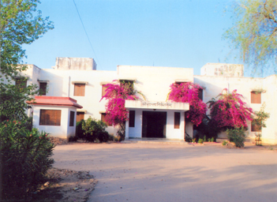
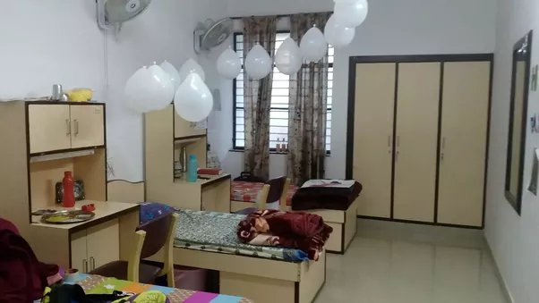

# _Hostel Tour_

Banasthali University is a residential institution. A student admitted to the University will compulsorily have to join a hostel unless the student is ward of a worker of the University and stays with him/her in the campus or the student belongs to a neighbouring village community within a radius of 2.5 Km. There are 31 student hostels in campus of the University. There is different number of rooms in each hostel ranging from 80 to 120. All rooms are well furnished with basic amenities provided. Each hostel has a separate Mess, Newspaper and Telephone facility

The addition of the two hostels Shri Shanta Aziram and Shri Shanta Niveshnam is a history as Banasthali University became the only University in Rajasthan and only the second in India to provide Personal Computers (PC) in every room of the hostel with Internet connectivity to the PG students, residents of the hostels.

A PC is provided with Internet in every hostel room for PG students currently residing in Shri Shanta Niveshanam, Shri Shanta Aziram, Shri Shanta Vasam, Shri Shanta Ayanam, Shri Shanta Pattnam, Shri Shanta Bhuvnam, Shri Shanta Nagram, Shri Shanta Gram, Shri Shanta Puri, Shri Shanta Nigam and Shri Shanta Peetham having CAT5, CAT6 and CAT6E cabling within the hostel building. The PC in a room is to be shared by all inmates. All those who wish to participate in the scheme and have a PC with Internet in their hostel room are paying a security deposit of Rs.10,000/- through DD/cheque drawn in favour of "Banasthali Vidyapith - A/c AIM&ACT". It helps the institute part-finance the project as the institute invested heavily in extending the network, whereas the PCs, UPS etc. procured through these deposits. This (interest-free) deposit is refunded along with the other security deposit at the time of withdrawal.

#### <h6 className="text-warning"> The complete list of hostels is as under: </h6>

| S.No.  | Hostel Name                   |
| :----- | :---------------------------- |
|   |                               |
| 1      | Shri Shanta Bai Shiksha Kutir |
| 2      | Shri Shanta Soudh             |
| 3      | Shri Shanta Vishwa Needam     |
| 4      | Shri Shanta Nilaya            |
| 5      | Shri Shanta Bhuwnam           |
| 6      | Shri Shanta Niwas             |
| 7      | Shri Shanta Niketan           |
| 8      | Shri Shanta Ayatan            |
| 9      | Shri Shanta Vihar             |
| 10     | Shri Shanta Dham              |
| 11     | Shri Shanta Nikunj            |
| 12     | Shri Shanta Puram             |
| 13     | Shri Shanta Paleyam           |
| 14     | Shri Shanta Alaya             |
| 15     | Shri Shanta Geham             |
| 16     | Shri Shanta Niveshanam        |
| 17     | Shri Shanta Ajiram            |
| 18     | Shri Shanta Gangotri          |
| 19     | Shri Shanta Vasam             |
| 20     | Shri Shanta Ayanam            |
| 21     | Shri Shanta Pattnam           |
| 22     | Shri Shanta Lok               |
| 23     | Shri Shanta Nagram            |
| 24     | Shri Shanta Kulam             |
| 25     | Shri Shanta Neri              |
| 26     | Shri Shanta Gram              |
| 27     | Shri Shanta Puri              |
| 28     | Shri Shanta Peetham           |
| 29     | Shri Shanta Nigam             |
| 30     | Shri Shanta Vatika            |
| 31     | Shri Shanta Aagar             |

 

#### <h6 className="text-info">One can see that all the hostels are named after 'Shanta bai' and students of the Banasthali are treated as the daughters of the University.</h6>

#### Map

 

|  |  |  |
| :---------------------------------------- | :---------------------------------------- | :---------------------------------------- |
