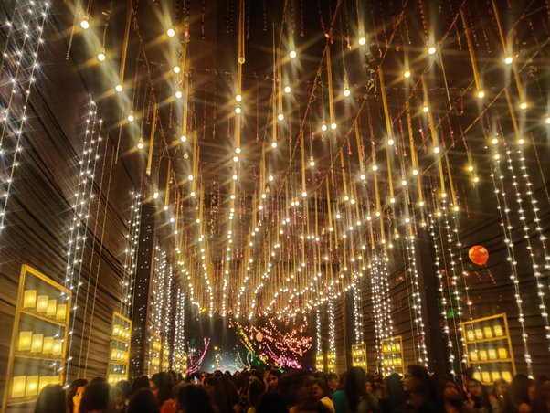

# _Apaji Mela_

With students coming from different parts of India, the 850 acre Campus Banasthali today with 16000 students itself is a mini India echoing the lines of Gurudev Rabindranath Tagore in National anthem “Panjaba-Sindhu-Gujarata-Maratha Dravida-Utkala-Banga.”

The evolution of Banasthali is nothing short of a fairy tale in which the parents freedom fighter and Gandhian Pt Hiralal Shastri and Padma Bhushan & Jamnalal Babaj Award winner Smt Ratan Shastri took up the mission with passion for setting up an institution at Banasthali to fulfill the desire of their beloved daughter Shantabai who died at a very young age but had sown the seeds of a school built with mud bricks made by her own hands for educating girls.

Youtube : https://www.youtube.com/watch?v=TySB1tzJJ1k

Banasthali today has the pride of having been chosen as a Faculty Development Centre under the MHRD Govt of India Pandit Madan Mohan Malaviya National Mission on Teachers and Teaching (PMMMNMTT) as well as for hosting Atal Incubation Centre (AIC) by NITI Aayog. Apart from various National Rankings which include India Today #2, FICCI University of the year 2015, NAAC A grade, MHRD NIRF 29, in recent past, Banasthali has been in national and international media attention for getting Quacquarelli Symonds QS Asia University Ranking, QS BRICS Ranking, Diamond status under QS i-Gauge Indian University Rating and the overall Four Star Ranking in - QS Stars Rated for Excellence with 5 Stars for each for Teaching, Employability, Facilities, Arts & Culture and Inclusiveness.

Being a comprehensive university, Banasthali offers graduate and post-graduate programmes in a vast variety of disciplines such as Arts, Humanities, Social Sciences, Bio-technology, Bio-science, Computer Science, Mathematical Sciences, Physical Sciences, Electronics, Engineering, Earth Sciences, Fine Arts, Management, Aviation Science, Education, Home Science, Design, Pharmacy, Law, Commerce and Journalism & Mass Communication. Globally, STEM disciplines have always been considered to be a male domain. Banasthali University has broken this myth long back by bringing girls to STEM education when the world was still grappling with meager enrollment of women in these fields. The unique five- fold educational ideology of Banasthali comprising of physical, practical, aesthetic, intellectual and moral aspects of education advocates an optimum blend of these components towards all-round development of students.

The 120th Birthday celebrations started on 23 Nov 2018 with the inauguration of “Apaji Vyayamshala” state of the art Gymnasium at noon followed by Sanskritik Sandhya a cultural evening presented by students filled with melodious songs and mood lifting dances. The entire campus was colourfully lit up making one wonder if heavens had descended at 26.3898° N, 75.8708° E.

24 November 2018 started with prayer followed by the students rendering soul lifting songs penned by Pandit Hiralal Shastriji himself. The celebrations included a two day Mela at Laxmibhai Maidan and awesome fireworks display on 24 Nov 2018. The mela attracted thousands of visitors and had an array of eating stalls, shops selling ethinic items and giant wheels, rocking dragon boat, merry gorounds, etc.

Vice Chancellor Prof Aditya Shastri dressed up like a sardarji surprised everyone in the mela grounds and a record number of selfies were taken by students with him. The celebrations concluded on 25 Nov 2018 with a grand dinner for the entire campus community.

The students and faculty who attended and participated in Apaji birthday celebrations left with beaming faces and pride that they were indeed part of an institution which is a jewel in the crown among the women’s universities not only in India today but across the globe.

For more details about Banasthali see Website: http://www.banasthali.org , Facebook: www.facebook.com/Banasthali.org

#### About Banasthali:

Established in 1935, the Institution which is also the largest fully residential women’s university in the world has played a big role in revolutionizing women’s education and empowerment in India for the last eight decades. Banasthali has scripted numerous success stories in a wide range of fields, and stands tall among the citadels of learning in India today. Proud to be Banasthali alumni who call themselves as Banasthalites can be found in all latitudes, longitudes and altitudes in all walks of life across the globe.
