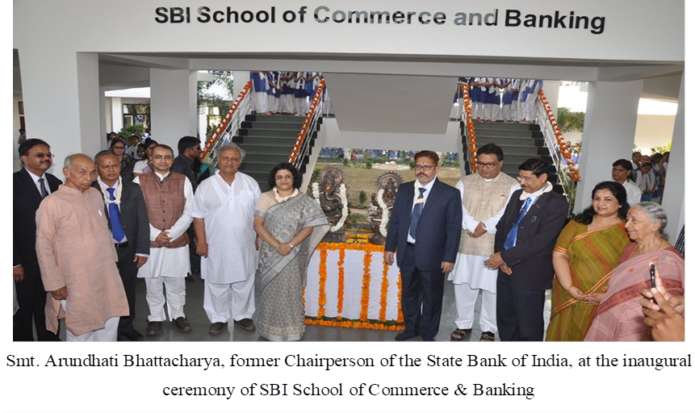
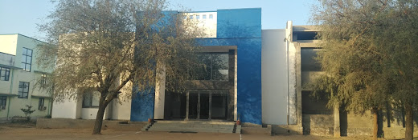
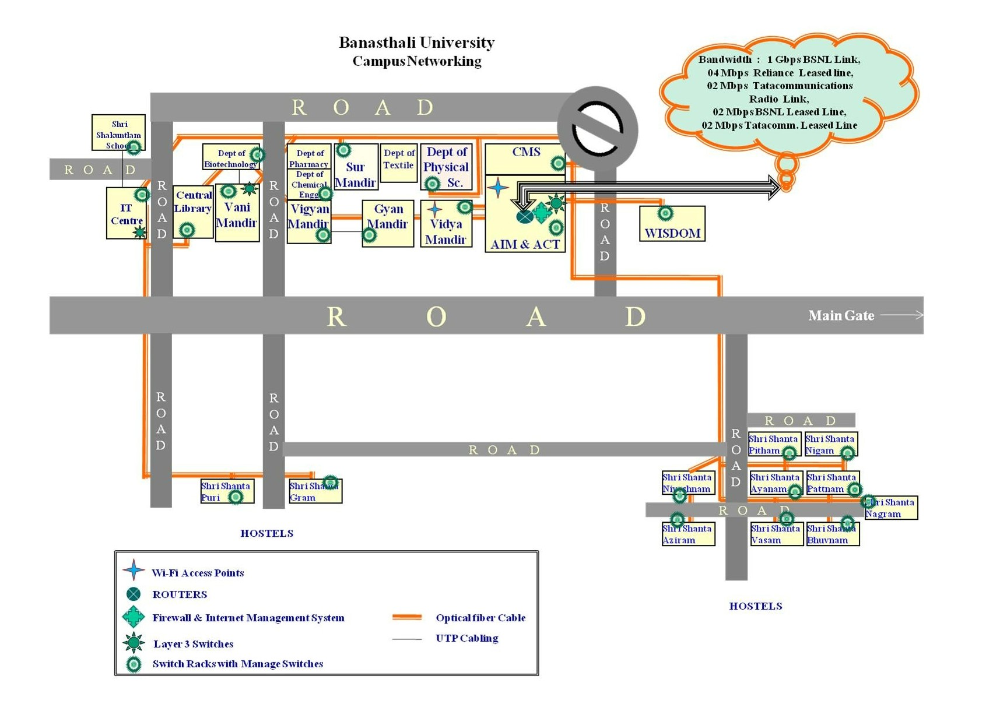

## _Departments In Campus_

 

<h4 className="text-center border-bottom text-success">Department of BioScience & BioTechnology</h4>

Biotechnology is a multi-disciplinary course and various programmes have been developed to meet the growing demand for trained manpower to carry out meaningful biotechnology activity in the country. In the last decade, Banasthali University has emerged as a leading center for education and research in biotechnology and allied disciplines. The programmes are designed to expose the students to recent exciting developments in the area of Biotechnology/ Bioscience/ Microbiology/ Bioinformatics and their application in industry, agriculture and medicine.

[More information](http://www.banasthali.org/banasthali/wcms/en/home/lower-menu/faculties/life-sciences/dep-of-bioscience-biotech/index.html)

<h4 className="text-center border-bottom text-success">Department of Chemical Engineering</h4>

The Chemical Engineering Department is one of the premier engineering departments of Banasthali University. It has a dynamic and goal oriented group of faculty well supported by experienced technical staff. The Department offers instructions at undergraduate level leading to a 4 year B.Tech degree. The instruction at the undergraduate level aims at providing the students a broad-based education with emphasis on theory and practice of Chemical Engineering, keeping in views the current and future requirements of the country. Students are encouraged to identify industrial problems. In-plant training in industrial organizations is a part of the regular undergraduate curriculum. In addition to the infrastructural facilities, pilot plant sized equipment as well as advanced instruments are available. These serve the multiple purposes of training the undergraduate students as well as carrying out research work for final application to solve industrial problems.

The department is also planning to propose a postgraduate level M.Tech program in Chemical Engineering. In which students will be trained to assume independent responsibilities laying emphasis again on the country’s current and future requirements in industry, R&D organizations, design firms and academic institutions.  The Department is well equipped for carrying out basic and applied research leading to the degrees of M.Tech.

_<h6 className="text-info">Scope and job prospects</h6>_
Chemical engineers are expected to have employment growth of more than 8 percent over the projections decade, about as fast as the average for all occupations. The most employment growth for chemical engineers will be in service-providing industries such as professional, scientific, and technical services, particularly for research in energy and the developing fields of biotechnology, nanotechnology and environmental awareness.

[More Information](http://www.banasthali.org/banasthali/wcms/en/home/lower-menu/faculties/life-sciences/dep-of-chemical/index.html)

<h4 className="text-center border-bottom text-success">Department of Chemistry</h4>

M.Sc. programme in Chemistry was started when the Department of Chemistry was established in 1970. Eversince its inception the Department has earned a good reputation of being an important centre of imparting the quality education in teaching and research. In addition to offering PG and Ph.D. programmes in Chemistry. The Department also offers the UG programme (B.Sc.). Its PG programmes are of two years duration, comprising of four semesters course work.

The Department offers Ph.D. programme in Chemistry. More than sixty students have been pursuing research work in thrust area programmes in these disciplines and on other related subjects. The Department has eleven members in its teaching faculty, a good number of them are very senior members who have been serving the Department for more than thirty years. Their unstinted efforts in career building of the students inspire them to reach to the newer heights of excellence in their academic pursuits.

Our postgraduate programme in chemistry has been designed to develop skilled manpower in the field of these disciplines. The high caliber of education which it imparts, prepares the students, on one hand to meet the requirement of the global demand of the trained manpower in research / industries and on the other hand equips them to excel as a new generation professionals to face the challenges of the twenty first century.

[More Information](http://www.banasthali.org/banasthali/wcms/en/home/lower-menu/faculties/life-sciences/dep-of-chemistry/index.html)

<h4 className="text-center border-bottom text-danger">Department of Computer Science</h4>

Computer Science is the core of Faculty of Mathematics and Computing. The department operates from the building "ICICI Centre for Advanced Studies in Computer Science". This building has been constructed from the generous financial assistance from ICICI.The Building has fully equipped lecture theaters, seminar rooms, office space for faculty, laboratories and departmental library. The laboratory is equipped with state of art IT infrastructure such as Silicon Graphics server and workstations, for students and researchers. These are in addition to fairly large number of stand-alone PCs for regular development work.The institute acts as a backbone to provide campuswide LAN and internet connectivity to the campus.

The recent addition of Artech - Dalmia I.T. center with smart classrooms and high end computing facilities (hardware as well as software) has further augmented the activities of the department.The department offers undergraduate and postgraduate programmes in Computer Science, Computer Applications and Information Technology including M.Tech. at Banasthali Vidyapith, Campus.

[More Information](http://www.banasthali.org/banasthali/wcms/en/home/lower-menu/faculties/maths-app-comp-tech/computer_science/index.html)

<h4 className="text-center border-bottom text-warning">Department of Commerce and Management</h4>

Vision of Faculty of Management Studies (FMS-WISDOM) at Banasthali Vidyapith is to prepare women for enlightened leadership roles in all walks of life. Institute's mission is to contribute towards development of women leadership that would play active role in society-building, entrepreneurship and management of organizations and institutions in consonance with nation's spiritual and cultural heritage and its own context.

The following represents the five foundational principles or the Panchsiddhanta of WISDOM:

> \*WISDOM acts as strategic think-ahead forum for women's issues in management of society, organizations and individuals

> \*WISDOM facilitates creation of future enlightened leadership among women

> \*WISDOM trains the young minds for managerial responsibilities and entrepreneurial ventures

> \*WISDOM conducts action-based research

> \*WISDOM promotes intellectual self-reliance

In consonance with its foundational principles, the following are the broad objectives of the institute:

> 1.  To train women for managerial positions.

> 2.  To train women in entrepreneurial tasks of setting up industry, organizations and institutions

> 3.  To undertake research and consultancy with a view to augment knowledge base keeping in view the specific requirements of women's issue and cultural moorings.

[More Information](http://banasthali.org/banasthali/wcms/en/home/lower-menu/faculties/management/index.html)

<h4 className="text-center border-bottom text-info">School Of Automation</h4>

The School of Automation at Banasthali is quintessence of the University's relentless pursuit of excellence, where the students are exposed to real-world situations. The School was developed in collaboration with the Bajaj Group, one of the most distinguished business houses of India, provides the much needed modern engineering environment to the students to create systems and products with state of art infrastructure where the engineering graduates would learn to design innovative projects. The students would not only be trained hands on in real- life engineering tools but would also learn multi- disciplinary approach to fulfil societal and industrial requirements.

The School of Automation offers B.Tech. Programme in Electrical & Electronics, Electronics & Instrumentation and Mechatronics. The School also offers the elective courses in field of Mechatronics & Robotics to other B. Tech. Programme of University. The School is immersed in research & development in area of Machine Learning, Process Control, Humanoid, Robot Manipulations, Power system, Power Electronics, Renewable Energy, Industrial Automation and Manufacturing Technology.

The School of automation is equipped with most modern industrial setup procured from global technology giants such as BOSCH, FESTO, KUKA, Siemens, SMC, Mitsubishi, M-TAB and Janatics. The School features sophisticated laboratories which are the requirement of modern day automation including Computer Integrated Manufacturing (CIM) Lab, Advanced robotics, Mechatronics Lab, Hydraulics Lab, Pneumatics Lab, Virtual Lab, e-learning Lab, Programmable Logic Controller (PLC) Lab and Industry 4.0 to name a few.  The School also houses some basic labs like Sensorics Lab, Electrical Machine and Drives Labs. The School was able to attract the companies like Schenider to offer on-line program, scholarships and on campus and off campus placements. The B. Tech. programme has University Industrial Linkage as an integral part its curriculum in which students is pursuing their projects with external organizations. The students graduating from this department are placed in various companies of repute.

[More Information](http://banasthali.org/banasthali/wcms/en/home/lower-menu/faculties/automation/index.html#Teaching_Faculty)

<h4 className="text-center border-bottom text-danger">Department Of Education</h4>

The Department of Education had its origin as the college of Education within the Vidyapith in 1962 and was affiliated to the University of Rajasthan. It was the first wholly residential teacher education institute for women, in the whole region. Later on, when the Vidyapith gained the status of a Deemed University in 1983, the college of education got elevated as the Department of Education. The Department of Education and Physical Education were brought together as the Faculty of Education.

The department offers 4-Year Integrated Bachelor of Arts Bachelor of Education (B.A. B.Ed.), 4-Year Integrated Bachelor of Science Bachelor of Education (B.Sc. B.Ed.), 2-year Bachelor of Education (B.Ed.), Master of Education (M.Ed.) and Doctor of Philosophy in Education (Ph.D.).

At present, the department is recognized as one of the progressive teacher education institute in the country known for its quality and innovativeness. The teaching programs involve not only practicing new ideas and concepts but also acquiring skills to act on those concepts to generate personal understanding and articulate the same.

The Department of Education upgraded as ‘School of Education' by the Ministry of Human Resource Development, Government of India under its Pandit Madan Mohan Malviya National Mission on Teachers and Teaching scheme in October 2018.

[More Information](http://www.banasthali.org/banasthali/wcms/en/home/lower-menu/faculties/faculty-of-education/dept-of-education/index.html)

<h4 className="text-center border-bottom text-info">Department Of Economics</h4>

The Department runs B.A., M.A., M. Phil and Ph.D. Programmes. The Course objectives are to impart knowledge and develop understanding of the economy and to provide necessary analytical tools and intellectual training. Emphasis is therefore given on Economic Theory (Understanding), Indian Economy (Information) and Quantitative Techniques (Tools). The Curriculum is reviewed and if necessary revised every year. The faculty and students work on UGC and ICSSR sponsored research projects particularly relating to Indian Economic Problems. Research also takes place in the form of M.Phil and Ph.D. dissertations. The major thrust areas are Development Economics, International Economics, Public Finance, and Agriculture and Rural Development.The faculty has adequate representation in Conferences, Seminars and Workshops and has a number of publications in the form of papers and books.

The Department organizes Professor P.N. Mathur memorial Lectures every two years. Late Prof. P.N. Mathur was an eminent social scientist (specially an economist), founding member and Vice-President of Vidyapith. Eminent economists including Prof. V.R. Panchmukhi, Prof. A.M. Khusro,  Dr. Manmohan Singh, Prof. B.B. Bhattacharya, Prof. Bibek Debroy and Mr. Ashok Thakur have delivered the memorial lectures.

Department of Economics organizes an annual Academic Event ‘PRAGATI’ comprising activities such as Debate, Paper presentation, Quiz, Skit etc.

[More Information](http://www.banasthali.org/banasthali/wcms/en/home/lower-menu/faculties/social-science/economics/index.html)

<h4 className="text-center border-bottom text-info">Department Of Journalism and Mass Communication</h4>

Banasthali Vidyapith has been serving the democratic society for many decades by producing women icons in politics, administration and legislature. Media is the fourth pillar of the democracy and the Vidyapith intend to strengthen the pillar by creating women professionals with ethical values who could lead the existing and emerging media society.

The Department of Journalism and Mass Communication at Vidyapith is the successively working in the direction of spreading awareness in society about Journalism & Mass Communication as a possible and attractive field of study. The department was established in year 2014 to promote Journalism and Mass Communication (JMC) education and research as a culture that attracts wider participation. The department also motivates  aesthetic enrichment to provide necessary purpose and focus to women with a view to empower them towards bridging the needless prevalent gender disparity. The department provides an environment where students are naturally encouraged to take up education and research in JMC and nurture aesthetic mindset towards adopting JMC as a preferred career option. The department has laid the foundation for capacity building for high-end professional development and research through proposed educational programmes.

Journalism and Mass Communication education at Vidyapith is aimed to create women professionals with ethical values to contribute to the society and lead the industry. Journalism and Mass Communication process helps to understand how different elements of communication provide new development in social, political and economic context. The curriculum offers a systematic progression of hands-on production work, conceptual skills and artistic expression required to become an accomplished media practitioners in a social and technological environment. It also includes various on-field activities like real-time news reporting, on-field  news coverage, industrial training, developing actual advertising campaigns etc.

[More Information](http://www.banasthali.org/banasthali/wcms/en/home/lower-menu/departments/journalism_masscomm/index.html;jsessionid=AD2DF6FE8EA88DE5D065D203FA8587E3)

<h4 className="text-center border-bottom text-info">Department Of English & Modern European Languages</h4>

The Department of English and MEL runs regular courses in English, French and German. Need based certificate courses in conversational English, German, French and Spanish are also part of the academic programmes of the department. It came into being  in 1943 with the introduction of B.A in English. The department started M.A. in English in 1963 and M.Phil.(ELT), still a rare course, in 1987. The doctoral work is performed both in literature and language. The department functions on an interdisciplinary approach and caters to the needs of scholars interested in the areas of Indian Literature, American Literature and Sanskrit Aesthetics. Modern European languages (French and German) are very popular among students. A fully equipped language laboratory fulfills the demands of autonomous learning of language.

[More Information](http://www.banasthali.org/banasthali/wcms/en/home/lower-menu/faculties/faculties-of-humanities/english/index.html)

<h4 className="text-center boredr-bottom text-info">Department Of Legal Studies</h4>

Banasthali Vidyapith has long history of nurturing women leaders in all walks of life. Of late its IT, Management and Technology graduates have won accolades for themselves and their alma mater. In the same line, the Vidyapith has conceptualized an all women's law school to nurture legal professionals of the highest order possessing the usual strong virtues of the Vidyapith. Faculty of Law at the Banasthali Vidyapith was established in the year 2013 with the aim of imparting world class legal education to girls from various parts of the country.

The Jamnalal Bajaj Foundation very kindly consented to give a onetime philanthropic grant to partially meet the expenses of the Law School Building, named as Jamnalal Bajaj School of Legal Studies. The vision of legal education is to provide justice oriented education essential to the realization of values enshrined in the Constitution of India.

Legal education as an aspect of professional education has assumed considerable significance, not only in terms of the historical utility of law in society but also in the current context of globalization. Legal education is a vital link in the creation of knowledge concept as well as in the application of such concept in society. The need for trained law personnel in academia, litigation, corporate practice, government and civil society has increased significantly over the last few years and it is estimated that the demand for such trained personnel will rise far more exponentially in the years to come.

The Law School aims at preparing women legal professionals who will play decisive leadership roles, not only as advocates practicing in courts, but also as academicians, legislators, judges, policy makers, public officials, civil society activists, and legal counsels in the private sector, maintaining the highest standard of professional ethics and a spirit of public service. We are aware that legal education should also prepare professionals equipped to meet the new challenges and dimensions of internationalization, where the nature and organization of law and practice are undergoing a paradigm shift. At the same time, legal education must also be socially engaged and sensitize students to issues of social justice. New and innovative solutions are needed to ensure that common people have access to justice, and the legal ideas and legal knowledge protect their interests. Therefore, it is imperative that legal education should prepare students with the aptitude, interest, commitment, skills and knowledge necessary to work with socially excluded people and the poor at the grass-root level to advance the cause of justice.

[More Information](http://banasthali.org/banasthali/wcms/en/home/lower-menu/faculties/law/index.html)

<h4 className="text-center border-bottom text-info">Department Of Hindi and Modern Indian Languages</h4>

The Department of Hindi and Modern Indian Languages is one of the oldest departments of Banasthali. The mission of the department is to provide aesthetic, practical and moral education to the students by means of literature and language. The department in addition to offering Hindi as a foundation course  or an elective course at bachelor's level and postgraduate level also assists in  developing communication skills and in personality development by organizing seminars, workshops , debates and lecture and gives a platform to the research students aspiring for excellence.

[More Information](http://www.banasthali.org/banasthali/wcms/en/home/lower-menu/faculties/faculties-of-humanities/hindi/index.html)

<h4 className="text-center border-bottom text-success">Department Of Earth Sciences</h4>

The School of Earth Sciences, Banasthali Vidyapith comprises of four disciplines namely Geography, Remote Sensing, Geology and Environmental Science; offers leading education and carries out innovative research, using excellent facilities in an energetic, convivial and comprehensive environment. The school has high-quality infrastructure for classroom education and field studies in Earth Sciences. School focuses on understanding fundamental earth processes through field observations, survey, laboratory experiments and computational simulations. We aim to develop new dimensions in research and teaching through multidisciplinary interactions. School offers programmes at the under-graduate, post-graduate and doctoral level. School also encourages overall personality development of the students by conducting workshops, guest lectures, quiz competition, model-chart exhibition, debate/extempore and cultural activities as part of five-fold education.

[More Information](http://103.214.128.135/earthscience/)

<h4 className="text-center border-bottom text-info">Department Of History And Indian Culture</h4>

The main thrust areas of teaching in the Department at the postgraduate level are Modern Indian History, Regional history of Rajasthan and historiography. The Department aims at teaching of history objectively with an inter-disciplinary approach. The students are initiated to develop insight into the complexities of history and to correlate them with the latest trends of historical writings. Their critical and analytical faculties are developed by encouraging them to read the latest books and journals on the subject and to writen term papers. This objective is further realized by furnishing the Central Library with good text books and the latest publications in history, and by incorporating new research accomplishments in the syllabi of postgraduate and undergraduate classes. Besides, research journals of premier research centers and universities are subscribed as they are the trendsetters and guide for the researchers.

The Department has an integrated doctoral programme. It is reflected by the working of research scholars on art and architecture, environment, women, peasants, socio-economic and a host of other areas. The faculty members are also actively engeged in research; they have published research papers as well as presented these in the national and international seminars and conferences.

[More Information](http://www.banasthali.org/banasthali/wcms/en/home/lower-menu/faculties/social-science/history_indian_culture/index.html)

<h4 className="text-center border-bottom text-danger">Department Of Mathematics & Statistics</h4>

Mathematics is the music of mind and it attracts people of finest minds in the world. It is the backbone of all sciences. If a  question arises  like which came first in human civilization  - Mathematics or Language? Certainly the answer is Mathematics. If we go back to the begining of stone-age civilization we can see that people used to count their domestic animals by using different stones, and they used body languages to express their mind.

If we study Vedic Mathematics then we can find that the most important number 'Zero' was discovered in India. One of the important irrational like  'Pie' was discovered by the great Indian Mathematician Aryabhatte (476 - 550 AD), who was born in Patliputra in Magadh.

Today there is no nobel prize in Mathematics but International Mathematical Union (IMU) offers Fields Medal once in every four years during International Congress of Mathematicians. (ICM) which is equivalant to nobel prize.

[More Information](http://www.banasthali.org/banasthali/wcms/en/home/lower-menu/faculties/maths-app-comp-tech/maths/index.html)

<h4 className="text-center border-bottom text-success">Department Of Home Science</h4>

Faculty of the Home Science is the site of veritable beehive of activity where teaching, research and extension works go hand in hand in perfect unison. The Faculty strives to cultivate capabilities and skills in the students for taking up challenging professions catering to societal needs to various aspects of human development, ecosystem, normal and therapeutic nutrition, food processing, textile testing, dress designing and dietary and family counseling.

The extension activities of the faculty are diverse and help rural people in child care, processing and preservation of food, dress designing and tailoring, guiding parents and community people for behavioural problems of children and deal with social problems.
The mission is to provide education, with a commitment to high quality, value based and holistic education responsive to the needs of the society and the country.

[More Information](http://banasthali.org/banasthali/wcms/en/home/lower-menu/faculties/home-science/index.html)

<h4 className="text-center border-bottom text-danger">Department Of Performing Arts</h4>

Established in 1943, The department of Music has been one of the oldest departments of Banasthali . It has the honor of having great personalities as its architects such as Raja Bhiya Poonchwale, S.C.E.R. Bhatt, Pt. Vinayak Rao Patwardhan and Narayan Rao Vyas. The department was the first to start M.A. Music (Vocal and Instrumental) under the headship of Prof. B.R. Deodhar and later the personalities like P.N. Chichore and N.V. Patwardhan have headed the department.

[More Information](http://www.banasthali.org/banasthali/wcms/en/home/lower-menu/faculties/fine-arts/dept_of_music_and_dance/index.html)

<h4 className="text-center border-bottom text-success">Department Of Pharmacy</h4>

Ever since, Vidyapith envisaged starting courses in Pharmacy, the aim has been to specifically design the course to develop manpower, which meets the global requirement of skilled professionals in the rapidly growing need of pharmaceutical industries.

Department places sufficient emphasis on putting theoretical concepts into practice by assigning industrially relevant problems and the same is clearly reflected in the curricula of the Pharmacy courses.

Bachelor and Masters programme in Pharmacy has been established with a view to promote excellence in pharmaceutical education and to prepare young women to meet the challenges in the area of pharmaceutical industries, education, research, development and marketing.

In addition to this the department offers Ph.D. programme in Pharmacy. Department has undying passion for research and most of the faculty members are engaged in research activities which includes synthesis, identification and optimization of lead compounds, development of biological assay methods and formulation development of drugs for better pharmacokinetics and dynamics. Drug Discovery Research Lab of the Department is an over busy facility equipped with ultra modern software like Discovery Studio, TSAR, SYSTAT, Chemdraw Ultra and modern equipments for pharmacological evaluation.

The Department has highly qualified faculty members specialized in different areas of pharmaceutical sciences; their unstinted efforts in career building of the students inspire them to reach to the newer heights of excellence in their academic pursuits.

In only few years the Department has established itself as a leading centre for Pharmaceutical Sciences education and have found a respectful place in the community of university institutions imparting Pharmacy education in India.

[More Information](http://www.banasthali.org/banasthali/wcms/en/home/lower-menu/faculties/life-sciences/dep-of-pharmacy/index.html)

<h4 className="text-center border-bottom text-danger">Department Of Physical Education</h4>

The Department of Physical Education  is well equipped with modern infrastructure and includes activities like Equestrian, Swimming, Flying, Riffle Shooting, Basketball, Volleyball, Badminton, TT, Cricket, Handball, Softball, Judo, Football, Netball, Athletics (track and field), Acrobatics, Martial Arts. Sports are in fact  a way of life  for the students conscious of health fitness and those looking for professional star status.  Physical education, a learning experience, offers a unique opportunity for problem - solving and self-expression and socialization. A well implemented, comprehensive programme is an essential component to the growth of both mind and body.

[More Information](http://www.banasthali.org/banasthali/wcms/en/home/lower-menu/faculties/faculty-of-education/dept-of-phy-edu-n-sports/index.html)

<h4 className="text-center border-bottom text-danger">Department Of Physical Sciences</h4>

The Department of Physical Sciences is one of the oldest in the Vidyapith. The PG programme in Physics as M.Sc.(Physics) started  in 2005. The courses are reviewed every year by Board of Studies and the faculty members. The faculty has recently recommended revision to give more visibility to Nanoscience and Technology. Therefore the courses on Nanotechnology is introduced as two elective courses one each in M.Sc. III and IV semesters respectively as “Physics of Nanostructures and Nanotechnology-I” and “Physics of Nanostructures and Nanotechnology-II”. This has been implemented from the session 2008-09.  The  M.Sc.(Physics) course is offered with specialization in Advance Communication, Nanotechnology, Condensed Matter Physics, Plasma Physics, High Energy Physics and Non-conventional energy resources.

[More Information](http://www.banasthali.org/banasthali/wcms/en/home/lower-menu/faculties/maths-app-comp-tech/physics/index.html)

<h4 className="text-center border-bottom text-info">Department Of Political Science & Public Administration</h4>

The department of Political Science and Public Administration is one of the oldest departments of social science faculty in Banasthali University. The objectives of the department’s programme are to develop necessary analytical skills; to develop practical, comprehensive and competitive vision on the various issues of local, national and international importance to have an acquaintance with the latest trends; to develop good citizenship and leadership qualities; and also cultivate capabilities and skills in the students for taking up professional challenges within the parameters of value system of Banasthali University.

The Department runs Ph.D., M.Phil, Post Graduate and Under Graduate programmes in Political Science as well as under graduate programme in Public Administration. The courses of study are regularly revised and updated.

The main constituents of the curricula in Political Science are – Political Theory, Political Ideologies, Western and Indian Political Thought, National and International Politics, Politics of South Asia, comparative reflections on politics, Good Governance, National Movement and Constitutional development in India, and Emerging Trends in Political Science.

The main constituents of the curricula of Public Administration at undergraduate level are – Principles of Public Administration, Personnel and Financial Administration, Administrative Institutions and Comparative Administration, Emerging Trends in Public Administration and Public Administration at the local, state and national level in India.

[More Information](http://www.banasthali.org/banasthali/wcms/en/home/lower-menu/faculties/social-science/political/index.html)

<h4 className="text-center border-bottom text-info">Department Of Psychology</h4>
 

Psychology is a systematic and scientific study of human behavior. It deals with two critical relationships: the Brain Functions and Behavior and the Environment and Behavior. As scientists, psychologists follow scientific methods using careful observation, experimentation and analysis in a creative and innovative manner, evolving new approaches from established knowledge to meet changing challenges of people and societies. They develop theories and test them through their researches. They conduct both basic and applied researches in diversified fields and serve as consultants to communities and organizations. There are many subfields of psychology like Experimental, Quantitative, Social, Evolutionary, Developmental, Educational, Cognitive, Clinical, Counseling, Engineering, Forensic, Health, Industrial, Rehabilitation, Sports and Neuro Psychology to mention just a few.

[More Information](http://www.banasthali.org/banasthali/wcms/en/home/lower-menu/faculties/social-science/psychology/index.html)

<h4 className="text-center border-bottom text-info">Department Of Sanskrit, Philosophy & Vedic Studies</h4>

This department started functioning in 1943 with Bachelor's programmes. The postgraduate programmes were introduced after 1957. The department had such eminent scholars as Pt. Jaydevdev Vidyalankar, Shri Ramchandra Vaman Kumbhre, Prof. Praveen Chandra Jain, Pt. Jagdish Chandra Sharma, Prof. Ramesh Chandra Shastri, Prof. Shyama Bhatnagar, Prof. Chandra Kishore Goswami and Dr. Kusumlata Arya. They enriched the department with the great breadth of their learning and the depth of intense specialization. Their creative research made an impact upon the community of scholars and their high level of sustained efforts nourished the intellectual life inspired by their association with the faculties of other Universities. 

[More Information](http://www.banasthali.org/banasthali/wcms/en/home/lower-menu/faculties/faculties-of-humanities/sanskrit/index.html)

<h4 className="text-center border-bottom text-info">Department Of Sociology</h4>

Department of Sociology, one of the oldest departments, came into existence in Banasthali Vidyapith since its inception. The department has been offering courses at various levels since a very long time. The courses are designed to strike a balance between tradition and modernity. It aims to promote understanding among students on the contemporary complex patterns of social behaviour, thus enabling them to achieve success in their life.

The department offers courses at B.A., M.A. and M. Phil. level. There is also the provision of Ph. D. course under this department.  At UG level, apart from theoretical orientation students are also taught practical / behavioural subjects like mass communication, rural and urban sociology, social anthropology, research methodology, social demography etc. At the PG level, apart from core subjects, students are taught about new trends in sociology like sociology of health and medicine, globalization, popular culture and women studies etc.

[More Information](http://www.banasthali.org/banasthali/wcms/en/home/lower-menu/faculties/social-science/sociology/index.html)

<h4 className="text-center border-bottom text-danger">Department Of Design</h4>

Textile Designing was first introduced as a subject in Bachelor's programme of Banasthali University. Thereafter a Post Graduate diploma was started. Increasing demand and popularity of the subject led the Vidyapith to start the postgraduate programme M.A. (Textile Designing) in the year 2005.

[More Information](http://www.banasthali.org/banasthali/wcms/en/home/lower-menu/faculties/fine-arts/dept_of_texttile_and_design/index.html)

\

<h4 className="text-center border-bottom text-danger">Department Of Visual Arts</h4>

 
“Art is a unique mode of expressing a cultured way of life. The experience of joy related to the visible or invisible physical or astral body or sentiments being in real form, appear before human beings in expressive forms. That expression is termed art.”           - Prof. Aditya Shastri

The Department of visual art in Banasthali Vidyapith dates back to the origin of Vidyapith and it has been making continuous strides on the road of its growth. Retrospectively, Drawing subject was initiated with a single student in 1937. B.A. course was started in 1943. Diploma courses from way back in 1953. The department now offers degree Course in Drawing & Painting, B.A., M.A. & M.Phil. courses.

Achieved through personal vision, self-direction, critical ability, technical knowledge and creative energy the students are encouraged to build the capacity of critical thinking and life long learning. The U.G. and P.G. level programmes expose the students to various art disciplines viz. -Drawing, Design, Life Study, Portrait, Painting, Printmaking, Mural Painting, Art Appreciation, Fundamentals of art (pictorial elements) and history of world art and aesthetics.

[More Information](http://www.banasthali.org/banasthali/wcms/en/home/lower-menu/faculties/fine-arts/dept_of_visual_arts/index.html)

<h4 className="text-center border-bottom text-info">School of Architecture & Planning</h4>

The School of Architecture& Planning is a new venture at Banasthali Vidyapith offering a full-time 5-year degree program, approved by COUNCIL OF ARCHITECTURE, New Delhi. The inception of the school was done to provide the students of architecture with much-needed quality education with the help of modern infrastructure, tools, and equipment so that the students can produce more innovative & sustainable design solutions to fulfill societal and professional obligations. The students will be trained for hands-on experience in architectural field.

The School of Architecture also offers a wide range of elective courses in the field of applied and fine arts, technology, project management, structural systems, green buildings & rating systems, the latest software used in the Architecture & Planning field, sustainability, conservation, advance construction techniques, etc, in keeping with the need of the hour.

Banasthali Vidyapith has provided a top-notch infrastructure that is equipped with the most modern tools and equipment. The School features sophisticated workshops/ laboratories as prescribed by the Council of Architecture such as Carpentry Workshop, Environmental Lab, Surveying Lab, Computer Labs, Material Testing Lab, etc.

The studios and lecture halls are well equipped with audio-visual facilities, students lockers, sufficient drafting tables. The library is well equipped with 1075 books, 8 international architectural journals, 4 international architectural magazines, 11 general magazines &22 online e-resources.

The B. Arch program during its five years span offers students a wide range of courses to develop their skills and enhance their knowledge, not only in the field of architecture but also in allied fields. This will enable them to choose appropriate courses in their P.G. studies and professional practice.

The main objectives of the B. Arch Program are:

> 1.Empower women as professional architects, entrepreneurs, educators, etc.

> 2.Prepare students for contemporary architectural practices, keeping them deeply rooted in the Indian culture.

> 3.Enable students to connect to the global market trends in the field of architecture.

> 4.Studio-based exercises to focus on Learning by Doing, to build up a high level of confidence in students.

> 5.Prepare students as team leaders in the field of construction and allied activities.

> 6.The students will be motivated to prepare sustainable architectural design solutions, responding to socio-cultural, socio-economic, and environmental aspects.

> 7.The students will be encouraged to carry out research-based activities, even for a small topic of their academic subject.

[More Information](http://www.banasthali.org/banasthali/wcms/en/home/lower-menu/departments/arch_and_planning/index.html;jsessionid=AD2DF6FE8EA88DE5D065D203FA8587E3)

#### Map

#### Networking

The entire University campus is networked through optical fibre and powerful layer 3 and layer 2 (managed & unmanaged) switches and Cisco 1700, 1800 and 2620 routers housed at the Apaji Institute. The network is secured through a hardware firewall. Presently Banasthali University has a 2 Mbps leased line Internet connectivity from BSNL, Jaipur, 4 Mbps from VSNL, 4 Mbps from Reliance Info and another 1 Gbps link to university under NMEICT project. The institute maintains its own mail server banasthali.ac.in and Lotus Domino based Internal Messaging System and connected to Banasthali Domino server through web. The University is the first in Rajasthan and perhaps the second in India to provide 24 hours Network and Internet access to all its PG students in their hostel rooms. This facility is now provided in 8 hostels. For this, the OFC is extended to the respective hostels. In addition the institute runs a lab of 70 Internet ready nodes to provide internet access to all students, researchers and faculty of Banasthali University.
